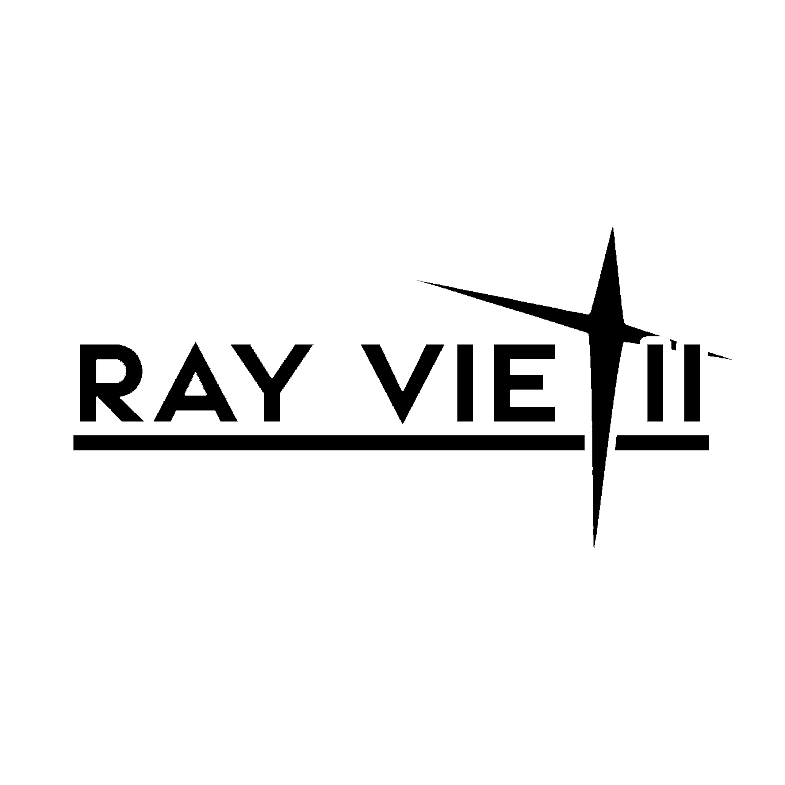

# Ray Vietii

🎨 Artist | ✍️ Writer/Worldbuilder | 🎼 Composer | 🧠 ML Enthusiast

Hey there, I'm Ray Vietii.  
I explore machine learning, fantasy worldbuilding, original languages, and sound creation.  
Most of what I do is self-driven, experimental, and a bit chaotic, but it's mine.

I'm also known as Rico 'Ray Vietii' Prayoga

---

## 🔧 Projects

- **RayVietii-DRm and Papermae**, My own fine-tuned **Stable Diffusion 1.5** models, trained for expressive anime-style generation.
- **Prinila Langua**, A conlang for my fantasy world. Includes grammar, poetic structure, and over 400+ lexicons.
- **Class V Amplifier**, An analog amp design I've been developing from scratch, based on a logic-style topology.

---
  
> Find me on:
> ([YouTube](https://youtube.com/@ray_vietii?si=54YiV0N5UfnqqSMm))
> ([Instagram](https://www.instagram.com/ray_vietii?igsh=MWczbzNtcTgwejhyeQ==))
> ([CivitAI](https://civitai.com/user/RayVietii))
> ([PixAI](https://pixai.art/@rayvietii/artworks))

